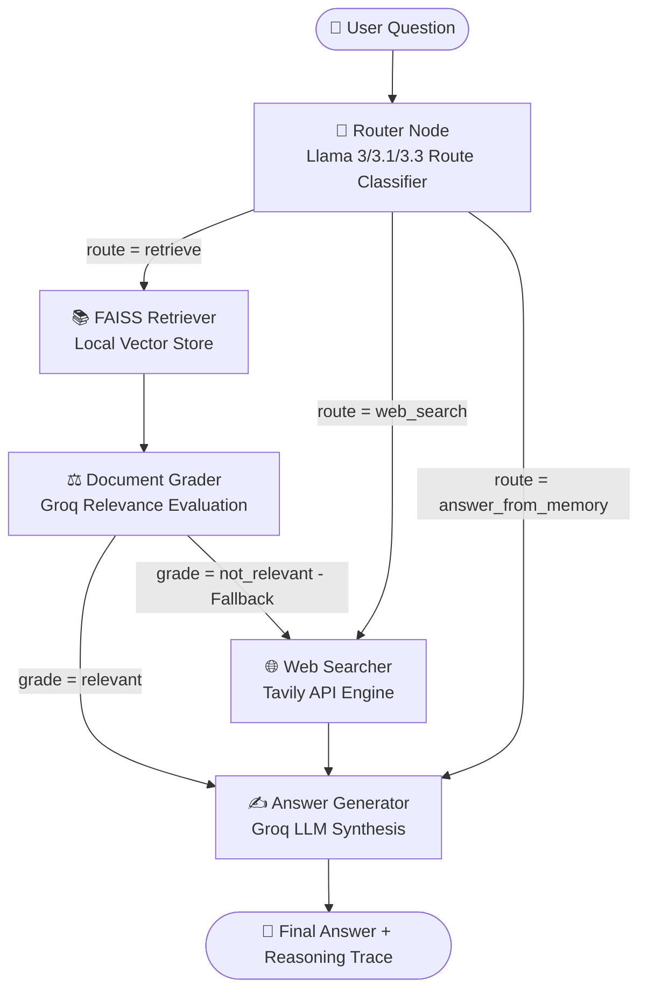

# ⚡ Dynamic Agentic RAG System (LangGraph, Groq, FAISS & Tavily)

An intelligent, multi-tier **Agentic Retrieval-Augmented Generation (RAG)** system built with **LangGraph**, **Groq (Llama 3 / 3.1 / 3.3)**, **FAISS**, **Tavily Web Search**, and **Streamlit**.

Unlike naive RAG systems that query database indexes unconditionally, this system acts as an **autonomous agent**—evaluating queries, routing runtime flows, grading retrieval relevance, falling back to the web when needed, and dynamically adjusting to your API credentials.

---

## 🌟 Key Features

1. **Dynamic Runtime Routing**:
   - **Local FAISS Vector Store**: Retrieves domain-specific / internal documents.
   - **Tavily Web Search**: Falls back to the live web for real-time news or missing documents.
   - **Internal Memory**: Answers general knowledge, coding questions, and logic directly without unnecessary retrieval.
2. **Zero-Cost Local Embeddings**:
   - Uses `all-MiniLM-L6-v2` via HuggingFace sentence-transformers. Runs entirely on your CPU with no API fees.
3. **Flexible Groq Integration**:
   - Fully compatible with Groq's fast, free inference models.
   - **Dynamic Model Selection**: Queries the Groq API on-the-fly and populates the UI with only the models your API key has active access to (e.g. Llama 3.3 70B, Llama 3.1 8B, Gemma 2, etc.).
4. **Semantic Document Grading**:
   - Evaluates retrieved document chunks before passing them to the generator.
   - If retrieved documents are irrelevant (`not_relevant`), automatically routes to **Tavily Web Search fallback**.
5. **Loop Safeguards**:
   - Uses a `fallback_count` guard in `AgentState` to prevent infinite routing cycles.
6. **Interactive Streamlit UI**:
   - **Live Reasoning Steps**: Expandable step-by-step trace showing router decisions, confidence scores, grader assessments, and retrieved context.
   - **Interactive Graph Visualization**: Mermaid architecture diagram visualizing the complete LangGraph workflow.
   - **Knowledge Base Inspector & Ingestion**: File uploader, one-click document ingestion, and FAISS index persistence.

---

## 📐 Architecture Flowchart



---

## 📁 Project Structure

```
d:/Antigravity projects/
├── app.py                   # Streamlit UI with live reasoning & graph visualizer
├── graph/
│   ├── __init__.py
│   ├── state.py             # AgentState TypedDict & ReasoningStep schema
│   ├── nodes.py             # Router, FAISS Retriever, Tavily Searcher, Grader, Generator
│   ├── edges.py             # Conditional routing & fallback logic
│   └── builder.py           # StateGraph builder and Mermaid exporter
├── rag/
│   ├── __init__.py
│   ├── ingestion.py         # Document parsing & recursive character text chunking
│   └── vectorstore.py       # FAISS index creation using local HuggingFace embeddings
├── tools/
│   ├── __init__.py
│   └── web_search.py        # Tavily search wrapper returning structured Documents
├── utils/
│   ├── __init__.py
│   └── prompts.py           # System prompts and Pydantic schemas (RouteDecision, etc.)
├── docs/                    # Sample knowledge documents (Policy, Specs, Handbook)
├── .env.example             # Environment variable template
├── requirements.txt         # Project dependencies
└── README.md
```

---

## 🚀 Quickstart Guide

### 1. Install Dependencies
Make sure you have [uv](https://github.com/astral-sh/uv) or `pip` installed:
```bash
pip install -r requirements.txt
```

### 2. Configure API Keys
Create a `.env` file (or enter keys directly into the Streamlit sidebar):
```env
GROQ_API_KEY=gsk_...
TAVILY_API_KEY=tvly-...
```

### 3. Launch Streamlit Application
```bash
streamlit run app.py
```
*(If Streamlit or python is managed by `uv`, use: `uv run streamlit run app.py`)*

### 4. Ingest Sample Documents
1. Open the Streamlit web interface (`http://localhost:8501`).
2. Click **"🚀 Ingest & Build"** in the left sidebar to embed the sample documents located in `docs/`.
3. Try any of the 3 quick-prompt buttons or type your own question!

---

## 💡 How to Properly Use the Project

### Basic Setup Flow
1. **Launch the app** and look at the left sidebar.
2. Under **🔑 API Credentials**, input your **Groq API Key** (and optionally **Tavily API Key** if you want web fallback search).
3. The **🤖 Groq Model** expander will update. Select your preferred model (e.g. `llama-3.3-70b-versatile` or `llama-3.1-8b-instant`).
4. Click **🚀 Ingest & Build** to load internal docs from `docs/` or upload your own files via the drag-and-drop uploader.

### Running Queries
- **Test Case 1 (Local QA)**: Click the **📚 Local FAISS Query** preset. The system will route to `RETRIEVE`, query the local database, verify relevance, and synthesize an answer grounded strictly in local documents.
- **Test Case 2 (Web Search)**: Click the **🌐 Web Fallback Query** preset. The router will dispatch the question to `WEB_SEARCH` because it's a real-time question not covered in local docs.
- **Test Case 3 (Direct Memory)**: Click the **🧠 Memory Direct Query** preset. The router determines that the query is general coding or math knowledge and answers directly from internal LLM weights, bypassing retrieval to save speed and tokens.

---

## 🛠️ Applications of this Project

- **Enterprise Customer Support**: Safely answers company-related FAQs using local policies, but seamlessly queries web-updates if user requests real-time data.
- **Academic Research Assistant**: Upload research papers, query them locally, and fall back to Google/Tavily search for related publications.
- **Corporate Knowledge Management**: Search internal documents, wikis, and technical manuals. The Document Grader ensures the LLM never hallucinates answers from irrelevant documents.
- **Code Generation & Review Tool**: Routes general coding queries directly to memory for instant synthesis, keeping retrieval resources focused on code repository guides.
