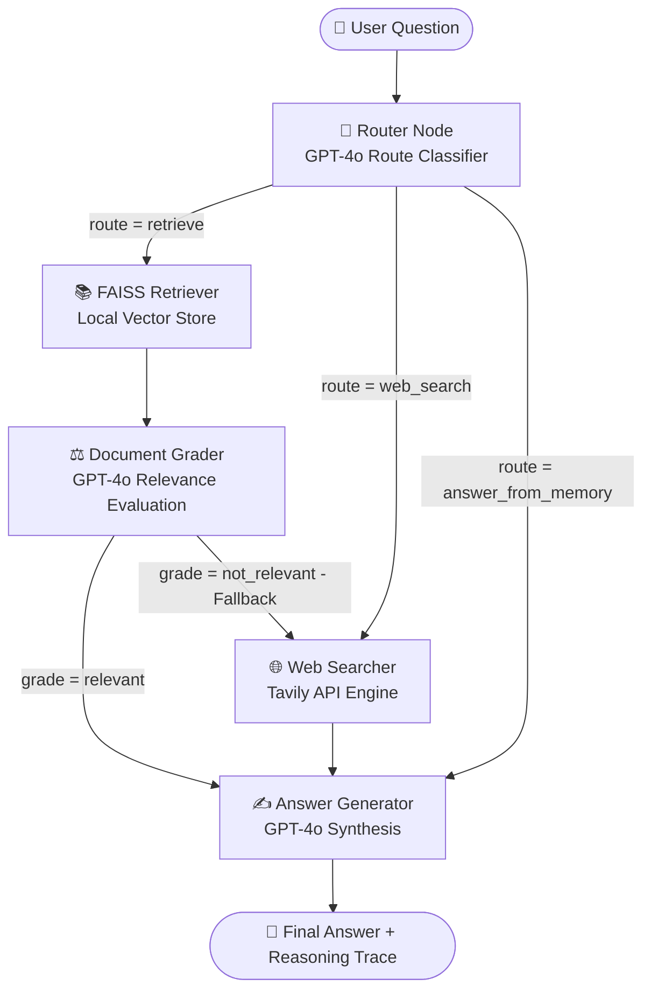

# ⚡ Agentic RAG System with LangGraph, FAISS & Tavily

An intelligent, multi-tier **Agentic Retrieval-Augmented Generation (RAG)** system built with **LangGraph**, **GPT-4o**, **FAISS**, **Tavily Web Search**, and **Streamlit**.

---

## 🌟 Key Features

1. **Dynamic Runtime Routing**:
   - **Local FAISS Vector Store**: Retrieves domain-specific / internal documents.
   - **Tavily Web Search**: Falls back to the live web for real-time news or missing documents.
   - **Internal Memory**: Answers general knowledge, coding questions, and logic directly without unnecessary retrieval.
2. **Semantic Document Grading**:
   - Evaluates retrieved document chunks before passing them to the generator.
   - If retrieved documents are irrelevant (`not_relevant`), automatically routes to **Tavily Web Search fallback**.
3. **Loop Safeguards**:
   - Uses a `fallback_count` guard in `AgentState` to prevent infinite routing cycles.
4. **Interactive Streamlit UI**:
   - **Live Reasoning Steps**: Expandable step-by-step trace showing router decisions, confidence scores, grader assessments, and retrieved context.
   - **Interactive Graph Visualization**: Mermaid architecture diagram visualizing the complete LangGraph workflow.
   - **Knowledge Base Inspector & Ingestion**: File uploader, one-click document ingestion, and FAISS index persistence.

---

## 📐 Architecture Flowchart



---

## 📁 Project Structure

```
d:/Antigravity projects/
├── app.py                   # Streamlit UI with live reasoning & graph visualizer
├── graph/
│   ├── __init__.py
│   ├── state.py             # AgentState TypedDict & ReasoningStep schema
│   ├── nodes.py             # Router, FAISS Retriever, Tavily Searcher, Grader, Generator
│   ├── edges.py             # Conditional routing & fallback logic
│   └── builder.py           # StateGraph builder and Mermaid exporter
├── rag/
│   ├── __init__.py
│   ├── ingestion.py         # Document parsing & recursive character text chunking
│   └── vectorstore.py       # FAISS index creation, persistence, and retrieval
├── tools/
│   ├── __init__.py
│   └── web_search.py        # Tavily search wrapper returning structured Documents
├── utils/
│   ├── __init__.py
│   └── prompts.py           # System prompts and Pydantic schemas (RouteDecision, etc.)
├── docs/                    # Sample knowledge documents (Policy, Specs, Handbook)
├── .env.example             # Environment variable template
├── requirements.txt         # Project dependencies
└── README.md
```

---

## 🚀 Quickstart Guide

### 1. Install Dependencies
```bash
pip install -r requirements.txt
```

### 2. Configure API Keys
Create a `.env` file (or enter keys directly into the Streamlit sidebar):
```env
OPENAI_API_KEY=sk-...
TAVILY_API_KEY=tvly-...
```

### 3. Launch Streamlit Application
```bash
streamlit run app.py
```

### 4. Ingest Sample Documents
1. Open the Streamlit web interface (`http://localhost:).
2. Click **"🚀 Ingest & Build"** in the left sidebar to embed the sample documents located in `docs/`.
3. Try any of the 3 quick-prompt buttons or type your own question!
